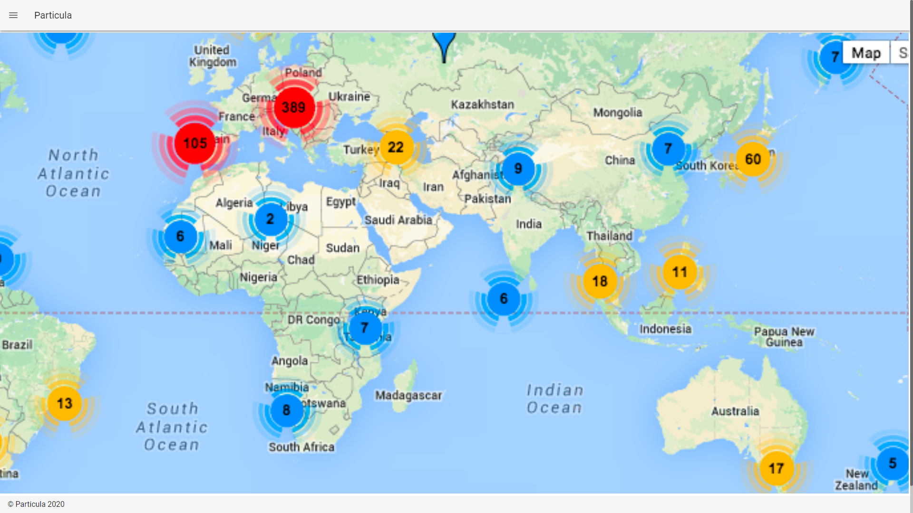
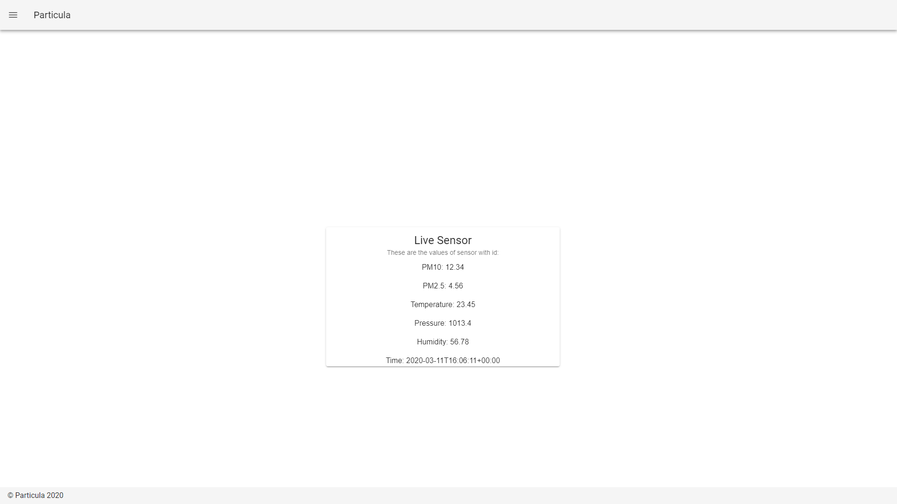
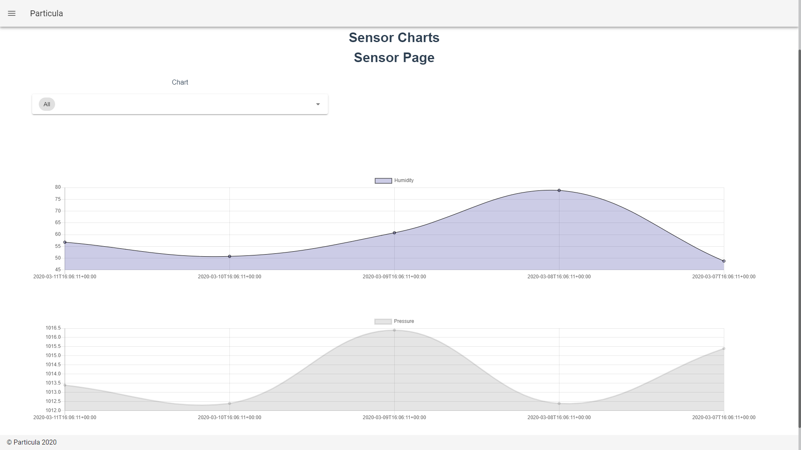
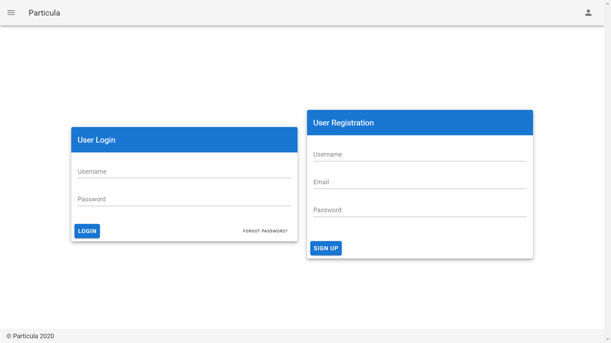
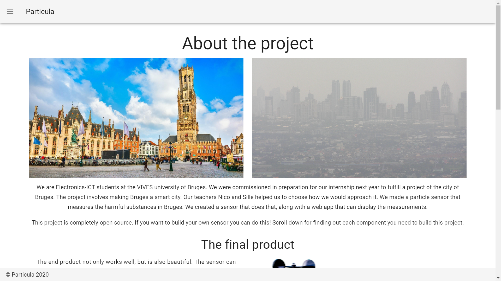

# frontend-hello-world

<<<<<<< .merge_file_a39532

=======

>>>>>>> .merge_file_a40712

## Project setup
```
npm install
```

### Compiles and hot-reloads for development
```
npm run serve
```

### Compiles and minifies for production
```
npm run build
```

### Lints and fixes files
```
npm run lint
```

### Customize configuration
See [Configuration Reference](https://cli.vuejs.org/config/).

## Docker build

```
docker build -t <name> .
docker run -d -p 8080:8080 <name>
```
Setting `EXPOSE` port to 8080

-> `192.168.99.100:8080`

## To run with nginx

```
docker build -t <name> .
docker run -d -p 8080:80 <name>
```

---

## Website pages

### Home

Displays a map with all sensors currently in the network.



### Live Values

A page with current values of a selected sensor.



### Historical values

A page with historical values of a selected sensor.



### Login/registration

Allows users to login or register to the platform.



### About

This page gives information about the Particula project.

